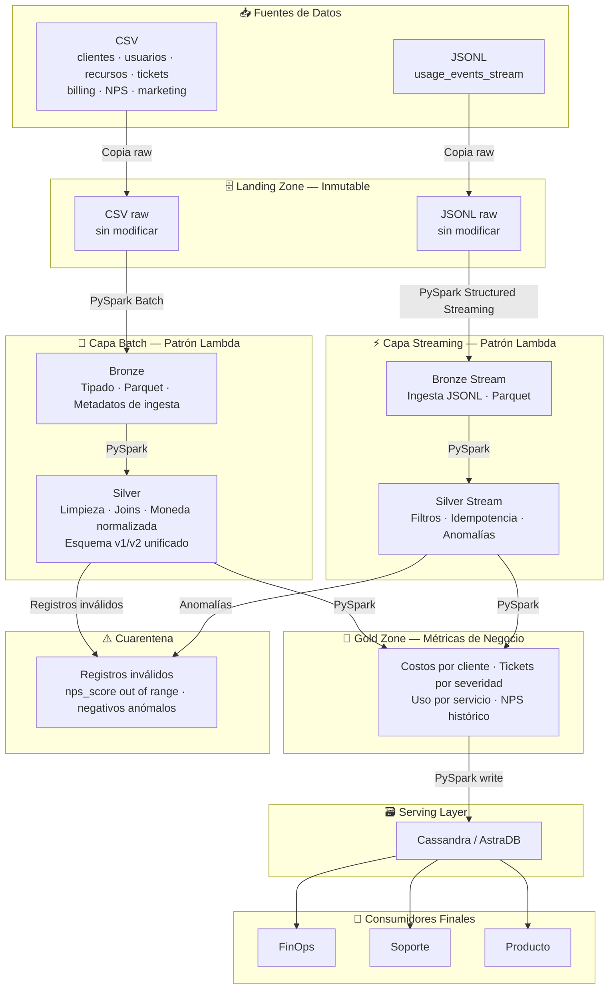

# Documento de diseño — Cloud Provider Analytics

## 1. Encuadre del problema
Soy del equipo de ciencia de datos de un proveedor de nube. Los datos de nuestros clientes (uso de servicios, facturación, tickets de soporte, etc.) llegan crudos, con errores, nulos y formatos inconsistentes. Mi trabajo es limpiarlos, ordenarlos y transformarlos para que las tres áreas de la empresa —FinOps, Soporte y Producto— puedan usarlos sin complicaciones la  información  de forma clara, confiable y que sea fácil de consultar.

Hoy, mucha de esta información se arma de forma manual, lo que lleva tiempo y es propenso a errores. Con este proyecto busco que se pueda  automatizar ese proceso, combinando dos formas de entregar la información:

Un dashboard online, actualizado casi en tiempo real, para que el usuario pueda ver el día a día.
Informes diarios y mensuales, para análisis más consolidados.
Como objetivos concretos para saber si esto funcionó:
Reducir el tiempo que hoy toma armar estos informes a mano, comparado con el tiempo que tarda una vez automatizado.
Reducir los errores que hoy aparecen en los informes, gracias a las reglas de calidad del pipeline.
Tener la información disponible rápido y de forma confiable, tanto en el dashboard como en los reportes periódicos.
## 2. Justificación de la necesidad de Big Data mediante volumen, velocidad, variedad, veracidad y valor
### Volumen:
"por la cantidad de datos que se manejan"
"Aunque solo se tiene 80 organizaciones, cada una genera eventos de uso constantemente  y en 60 días ya se acumulo  43.200 registros solo de esa tabla. Sumado a los tickets (1000), usuarios (800) y recursos (400), cruzar toda esta información a mano o en Excel se vuelve inmanejable, más aún pensando que en producción real serían miles de organizaciones, no 80."

### Velocidad:
"por que la tabla mas pequena es una tabla de refencia y la otra es de un historial o logeo" 
"customers_orgs es una tabla de referencia  donde cada organización se registra una vez y cambia muy poco con el tiempo (80 filas fijas). En cambio, usage_events_stream es un historial/log de eventos que se genera constantemente, cada vez que un cliente usa un servicio y por eso en solo 60 días ya  se acumula 43.200 registros. Esta diferencia de frecuencia es justamente lo que justifica usar Structured Streaming para los eventos.

### Variedad:
"Tengo dos tipos de archivo: CSV y JSONL. Dentro de los archivos JSONL, según la versión  (schema_version), los eventos con versión 2 incluyen los campos carbon_kg y genai_tokens, mientras que los de versión 1 no los tienen (aparecen como nulos)."

### Veracidad:
"Se encontro fechas guardadas con formata objet donde panda lo toma  como string (texto), varias tablas con nulos significativos como por ejemplo la columna carbon_kg tiene el 25% de valores nulos de un totla de 43.200 eventos valores fuera de rango cuando realice estudios preliminares en el estudio de calidad y tambien se encotraron costos negativos"

### Valor:
"En este proyecto busco convertir datos crudos y con errores en información clara, confiable y fácil de consultar. Por ejemplo, FinOps hoy tiene datos con nulos y valores negativos raros mezclados con los reales; una vez que el pipeline los limpia y los separa, FinOps puede confiar en los números que ve y detectar rápidamente una anomalía real de costo, en vez de perder tiempo revisando si el dato está mal cargado o si es un problema genuino y para que el usuario tenga la informacion feaciente mas visible mas organizada."
## 3. Inventario y perfil inicial de las fuentes: grano, frecuencia, tipos, calidad, trazabilidad y riesgos.

### Cardinalidad y Grano

| Relación | Cardinalidad | Grano | Descripción |
|---|---|---|---|
| customers_orgs - users | 1:N | un usuario | Una organización puede tener muchos usuarios; un usuario pertenece a una sola organización. |
| customers_orgs - resources | 1:N | un recurso en la nube | Una organización puede tener muchos recursos; un recurso pertenece a una sola organización. |
| customers_orgs - support_tickets | 1:N | un ticket | Una organización puede tener muchos tickets; un ticket pertenece a una sola organización. |
| customers_orgs - marketing_touches | 1:N | una interacción de marketing | Una organización puede tener muchas interacciones de marketing; una interacción pertenece a una sola organización. |
| customers_orgs - nps_surveys | 1:N | una respuesta de encuesta | Una organización puede tener muchas respuestas de encuesta; una respuesta pertenece a una sola organización. |
| customers_orgs - billing_monthly | 1:N | una factura | Una organización puede tener muchas facturas; una factura pertenece a una sola organización. |
| customers_orgs - usage_events_stream | 1:N | un evento de uso | Una organización puede tener muchos eventos de uso; un evento pertenece a una sola organización. |
| resources - usage_events_stream | 1:N | un evento de uso | Un recurso puede tener muchos eventos de uso; un evento pertenece a un solo recurso. |

### Frecuencias

customers_orgs y users se crean una sola vez, porque una organización se registra una sola vez. Lo mismo con un usuario: se da de alta una vez.

Resources, support_tickets, marketing_touches y nps_surveys se crean de vez en cuando porque considero que estos eventos pasan cuando algo puntual ocurre, sin un patrón fijo de tiempo. Un recurso se crea cuando el cliente decide desplegar algo nuevo, un ticket se abre cuando hay un problema, un touch de marketing pasa cuando el equipo decide hacer una campaña y las encuestas NPS se mandan esporádicamente, no en fechas fijas.

Billing_monthly es de manera fija pero mensual porque hay un patrón regular y predecible: se genera exactamente una vez por mes. Lo vemos con los datos reales: 240 filas ÷ 80 organizaciones = 3 (una por cada uno de los 3 meses del dataset: junio, julio, agosto).

usage_events_stream es de forma continua porque a diferencia de todas las demás, no tiene pausas y se genera todo el tiempo, las 24 horas, cada vez que alguien usa un servicio en la nube. Por eso en solo 60 días ya acumuló 43.200 eventos.

### Calidad

Las tablas tienen los siguientes problemas de calidad:

**Customers_orgs:** nulos en nps_score (13.75%), y un valor fuera de rango (101, cuando la escala NPS va de -100 a 100). La columna signup_date está guardada como texto en vez de datetime. Además, nps_score aparece también en Nps_surveys, lo que puede generar inconsistencias si los valores no están sincronizados.

**Users:** nulos en last_login (17.38%). Las columnas created_at y last_login están guardadas como texto en vez de datetime.

**Resources:** nulos en tags_json (20.75%). La columna created_at está guardada como texto en vez de datetime.

**Support_tickets:** nulos en resolved_at (24%) y csat (25.4%). Las columnas created_at y resolved_at están guardadas como texto. La columna csat usa una escala 0-7 poco habitual que conviene confirmar con la fuente.

**Marketing_touches:** sin problemas de nulos, pero la columna timestamp está guardada como texto en vez de datetime.

**Nps_surveys:** nulos en nps_score (20.65%) y comment (10.87%). La columna survey_date está guardada como texto en vez de datetime.

**Billing_monthly:** nulos en credits (57.08%), y un subtotal negativo (-1671.83). Las facturas vienen en tres monedas (USD, ARS y EUR); la tabla incluye exchange_rate_to_usd para convertir, pero si no se aplica en la capa Bronze las sumas quedan en monedas distintas y resultan incorrectas. La columna month está guardada como texto en vez de datetime.

**Usage_events_stream:** nulos en value (2.03%), unit (4.80%), carbon_kg (25%) y genai_tokens (92.75%); además costos negativos en cost_usd_increment. Los nulos de carbon_kg coinciden exactamente con los registros de schema_version = 1, lo que indica una evolución del esquema y no un error aleatorio. La columna value tiene tipo object en vez de numérico, lo que impide cálculos de consumo. La columna timestamp está guardada como texto en vez de datetime.

Ninguna tabla presenta filas duplicadas.

### Trazabilidad

**customers_orgs** es un archivo formato CSV y su clave única es org_id. Es la tabla central; por ende todas las demás tablas se conectan a ella por ese ID.

**users** es un archivo formato CSV y su clave única es user_id, y se conecta con customers_orgs a través de org_id.

**resources** es un archivo formato CSV y su clave única es resource_id, y se conecta con customers_orgs a través de org_id.

**support_tickets** es un archivo formato CSV y su clave única es ticket_id, y se conecta con customers_orgs a través de org_id.

**marketing_touches** es un archivo formato CSV y su clave única es touch_id, y se conecta con customers_orgs a través de org_id.

**nps_surveys** es un archivo formato CSV y no tiene una clave única propia, por lo que se identifica cada encuesta con la combinación de org_id + survey_date como clave compuesta, y se conecta con customers_orgs a través de org_id. Esto se debe a que si se usa solo org_id, la misma organización aparece varias veces y parecen datos repetidos; con survey_date, cada combinación es única y se puede identificar exactamente qué encuesta es.

**billing_monthly** es un archivo formato CSV y su clave única es invoice_id, y se conecta con customers_orgs a través de org_id.

**usage_events_stream** es un archivo formato JSONL y su clave única es event_id, y se conecta con customers_orgs a través de org_id y con resources a través de resource_id.

### Riesgos identificados

#### Riesgo 1: Costos negativos en billing_monthly y usage_events_stream

En billing_monthly encontramos un subtotal negativo de -1671.83. Estos valores no son errores, sino créditos reales del proveedor de nube, como devoluciones o ajustes por compromisos de uso. Si los eliminamos, el gasto neto mensual quedaría inflado y FinOps estaría tomando decisiones sobre números incorrectos. Por eso los mantengo y los marco como créditos.

En usage_events_stream encontramos cost_usd_increment con valores hasta -154.46. Acá lo considero una anomalía porque un recurso de nube no puede generar un consumo físico negativo.

#### Riesgo 2: Fechas guardadas como texto

En todas las tablas las fechas están guardadas como texto (tipo object en pandas). Esto significa que no se pueden hacer cálculos de tiempo, ordenar cronológicamente ni filtrar por rango de fechas correctamente. La mitigación es castear todas las columnas de fecha al tipo timestamp o date en la capa Bronze.

#### Riesgo 3: nps_score fuera de rango en customers_orgs

En customers_orgs encontré un nps_score con valor 101. El NPS válido va de -100 a 100, por lo que ese valor es imposible y distorsiona los promedios de satisfacción del cliente. Este registro se marca como outlier y se envía a quarantine.

## 4. Arquitectura de alto nivel

Los datos nacen como archivos en formato CSV y JSONL. Primero llegan a la zona de Landing sin modificarse. Después, usando PySpark, se procesan y llevan a Bronze, donde se les asigna el tipo de dato correcto y se agregan metadatos de ingesta. Luego pasan a Silver, donde se realiza la limpieza: se arreglan los nulos, se unen las tablas y se unifica el esquema v1/v2. En Gold se calculan las métricas finales (costos, tickets, uso) para cada dominio de negocio. Finalmente, los datos se cargan en Cassandra/AstraDB, donde los usuarios de FinOps, Soporte y Producto pueden consultarlos.

## 5. Patrón arquitectónico

Se eligió el patrón Lambda porque es un modelo diseñado para procesar datos combinando dos capas: una capa de velocidad, que procesa datos en tiempo real (streaming), y una capa de lotes (batch), que procesa grandes volúmenes de datos en intervalos de tiempo predefinidos. El proyecto tiene  dos caminos de procesamiento" — uno para datos que llegan periódicamente (batch) y otro para datos que llegan en tiempo real (streaming).: la fuente usage_events_stream requiere procesamiento en tiempo real (streaming), mientras que billing_monthly, support_tickets, customers_orgs, users, resources, nps_surveys y marketing_touches son datos periódicos que se procesan en lotes (batch). En nuestra modelo de arquitectura que proponemos, ambas capas se construyen con PySpark: la capa de lotes mediante procesamiento batch estándar, y la capa de velocidad mediante Structured Streaming.

Kappa no aplica porque solo utiliza procesamiento en tiempo real (streaming), con un único camino para todos los datos, y no es adecuado para datos maestros y periódicos como los que tiene este proyecto. 
Luego para la capa de presentacion del cliente todos los datos  convergen en la zona Gold, desde donde se cargan a Cassandra para su consumo.

## 6. Matriz requisito-componente

| Requisitos a tener en cuenta  | Herramienta que utiliza  | Zona que se encuentra  |justificación de la necesidad de Big Data: Volumen, velocidad, variedad, veracidad y valor |
|---|---|---|---|
| Ingestar 7 CSVs periódicamente | PySpark Batch | Bronze | Volumen, Variedad |
| Ingestar JSONL en tiempo real | PySpark Structured Streaming | Bronze | Velocidad |
| Preservar datos crudos sin modificar | Copia directa | Landing | Veracidad |
| Tipar campos y agregar metadatos de ingesta | PySpark | Bronze | Veracidad |
| Limpiar nulos, joins y normalizar moneda | PySpark Batch | Silver | Veracidad |
| Unificar schema v1/v2 | PySpark Streaming | Silver | Variedad |
| Costos, revenue y anomalías por org y servicio | PySpark Batch | Gold | Valor |
| Volumen de tickets, SLA y CSAT por org | PySpark Batch | Gold | Valor |
| Uso, requests y genai_tokens por servicio | PySpark Batch | Gold | Valor |
| Quarantine de registros inválidos | PySpark | Cuarentena | Veracidad |
| Idempotencia / re-ejecución sin duplicados | PySpark Structured Streaming | Silver Stream | Veracidad |
| Servir consultas por dominio | Cassandra/AstraDB | Serving | Valor |
## 7. Diseño del Data Lake

## 8. Flujo batch y streaming

## 9. Flujo MapReduce de referencia

## 10. Supuestos y riesgos

## 11. Estimación preliminar
