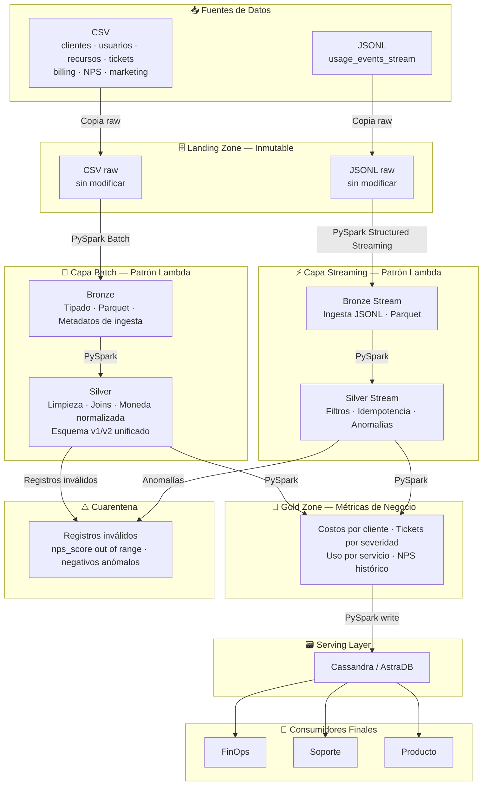

```mermaid
flowchart TD
    subgraph SRC["📥 Fuentes de Datos"]
        CSV["CSV\nclientes · usuarios · recursos · tickets\nbilling · NPS · marketing"]
        JSONL["JSONL\nusage_events_stream"]
    end

    subgraph LZ["🗄️ Landing Zone — Inmutable"]
        RAW_B["CSV raw\nsin modificar"]
        RAW_S["JSONL raw\nsin modificar"]
    end

    subgraph BATCH["🔄 Capa Batch — Patrón Lambda"]
        BRZ_B["Bronze\nTipado · Parquet · Metadatos de ingesta"]
        SLV_B["Silver\nLimpieza · Joins · Moneda normalizada\nEsquema v1/v2 unificado"]
    end

    subgraph STREAM["⚡ Capa Streaming — Patrón Lambda"]
        BRZ_S["Bronze Stream\nIngesta JSONL · Parquet"]
        SLV_S["Silver Stream\nFiltros · Idempotencia · Anomalías"]
    end

    subgraph GZ["🥇 Gold Zone — Métricas de Negocio"]
        GLD["Costos por cliente · Tickets por severidad\nUso por servicio · NPS histórico"]
    end

    subgraph QUAR["⚠️ Cuarentena"]
        Q["Registros inválidos\nnps_score out of range · negativos anómalos"]
    end

    subgraph SRV["🗃️ Serving Layer"]
        CASS["Cassandra / AstraDB"]
    end

    subgraph USR["👥 Consumidores Finales"]
        FO["FinOps"]
        SP["Soporte"]
        PR["Producto"]
    end

    CSV -->|Copia raw| RAW_B
    JSONL -->|Copia raw| RAW_S
    RAW_B -->|PySpark Batch| BRZ_B
    RAW_S -->|PySpark Structured Streaming| BRZ_S
    BRZ_B -->|PySpark| SLV_B
    BRZ_S -->|PySpark| SLV_S
    SLV_B -->|Registros inválidos| Q
    SLV_S -->|Anomalías| Q
    SLV_B -->|PySpark| GLD
    SLV_S -->|PySpark| GLD
    GLD -->|PySpark write| CASS
    CASS --> FO
    CASS --> SP
    CASS --> PR
```
